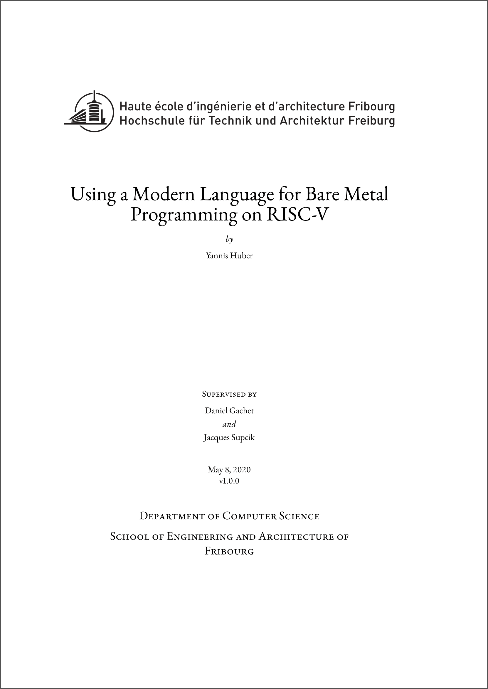

# Semester Project 6

This repository contains the report for my semester project 6 at the School of Engineering and Architecture of Fribourg (see [report.pdf](./report.pdf)).

  

## Abstract
In this project we explore the use of a modern programming language and compiler to produce bare metal
programs targeted at RISC-V based embedded systems. To illustrate this, we have made contributions
to an existing Go compiler called TinyGo. The goal is to extend the compiler’s support for the HiFive1
Rev B RISC-V based board. Features such as I²C and SPI have been developed or extended as a way
to get familiar with the compiler and its associated runtime library. This document also serves as
an introduction to the RISC-V instruction set architecture and discusses some interesting aspects of
compiler design.
